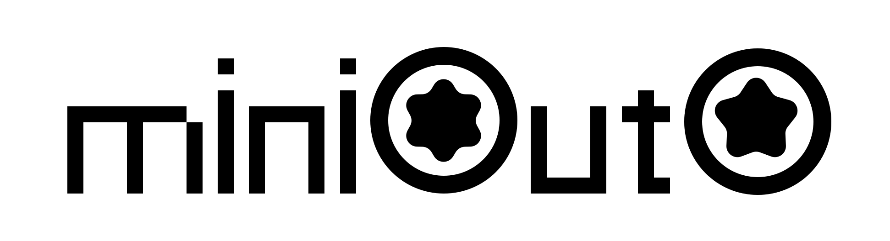

# miniouto

<p align="center">
  
</p>

A minimal, file-driven CLI agent harness built on [coreouto](https://github.com/llaa33219/coreouto).

Three principles:
1. **Minimalism** — No bloat. Extend with styles.
2. **Automation-friendly** — Full CLI; TUI is optional.
3. **Fluidity** — Adapts to any environment.

## License

[Apache License 2.0](./LICENSE)

## Install

```bash
uv sync
uv tool install --editable . --force   # or `uv tool install .` for a pinned build
```

## Quick start

```bash
# Either add a provider by hand:
miniouto provider add \
  --name openai \
  --api-key sk-... \
  --base-url https://api.openai.com/v1 \
  --default-model gpt-5.5            # optional; used when chat --model is not given

# Or browse the lma (llm-model-api) catalog and add from there:
miniouto lma providers               # see all 144 providers
miniouto lma add Anthropic --api-key sk-ant-...   # adds it with the first lma model

miniouto provider default openai
miniouto style set default
miniouto chat "hello"
miniouto                              # TUI mode
```

## Model resolution

The active model is chosen by the first match in:

1. `miniouto chat --model <name>` (per-call override)
2. `settings.model` (legacy per-session override; cleared whenever the TUI model picker saves)
3. `miniouto provider add --default-model <name>` (provider-level default)
4. error — no model can be inferred

## Commands

| Command | Purpose |
| --- | --- |
| `miniouto chat "prompt"` | One-shot chat turn |
| `miniouto` | TUI mode |
| `miniouto status` | Show current configuration |
| `miniouto provider add/list/remove/default` | Manage providers |
| `miniouto style list/set/add/show` | Manage style documents |
| `miniouto lma providers/models/add` | Browse the lma (llm-model-api) catalog and add providers from it |

### `chat` flags

| Flag | Effect |
| --- | --- |
| `--name` | Session name (persists to `~/.miniouto/settings.toml`) |
| `--provider` | Override the active provider for this call |
| `--model` | Override the resolved model for this call |
| `--style` | Override the active style for this call |
| `--max-tokens` | Cap output tokens |
| `--temperature` | Sampling temperature |
| `--continue` / `-c` | Prepend the session's previous history |

## Storage

Everything lives under `~/.miniouto/`:
- `providers.toml` — provider configs (api_format, base_url, api_key, default_model)
- `settings.toml` — active provider, style, session
- `style/<name>.md` — style documents
- `sessions/<name>.json` — conversation history

Override the root with the `MINIOUTO_HOME` environment variable.
